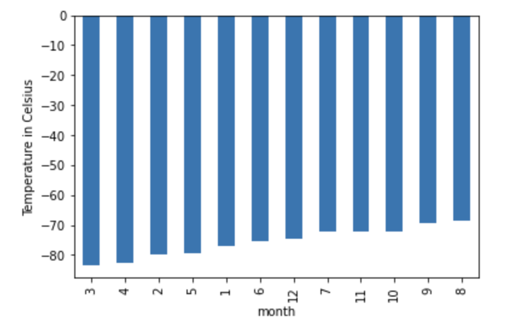
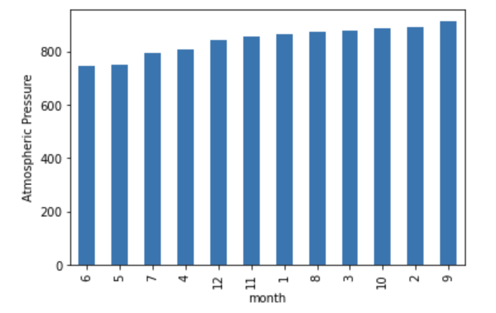

# webscraping-mars-news-weather
A web-scraping and data analysis project designed to practice isolating HTML elements on Mars news and weather pages, identifying their `id` and `class` attributes, and using this knowledge to extract information via both automated browsing (`Splinter`) and HTML parsing (`BeautifulSoup`).

## Background
The goal here is to strengthen skill in data collection, organization and storage, as well as analysis and visualization. We will scrape various types of information, including HTML tables and recurring elements—news articles in this instance—on a webpage. Deliverables are as follows:

- *__Deliverable 1:__ Scrape titles and preview text from Mars news articles.*
- *__Deliverable 2:__ Scrape and analyze Mars weather data, which exists in a table.*

### Part 1: Scrape Titles and Preview Text from Mars News
1. Use automated browsing to visit the Mars news site. Inspect the page to identify which elements to scrape. The URL is https://static.bc-edx.com/data/web/mars_news/index.html

2. Create a Beautiful Soup object and use it to extract text elements from the website.

3. Extract the titles and preview text of the scraped news articles. Store the scraping results in Python data structures as follows:
    * Store each title-and-preview pair in a Python dictionary and, give each dictionary two keys: title and preview. An example is the following:

    ```
    {'title': "NASA's MAVEN Observes Martian Light Show Caused by Major Solar Storm", 
     'preview': "For the first time in its eight years orbiting Mars, NASA’s MAVEN mission witnessed two different types of ultraviolet aurorae simultaneously, the result of solar storms that began on Aug. 27."}
    ```
    * Store all the dictionaries in a Python list.
    * Print the list in your notebook.

4. Store the scraped data in a file (to ease sharing the data with others). To do so, export the scraped data to a JSON file.

### Part 2: Scrape and Analyze Mars Weather Data
1. Use automated browsing to visit the Mars Temperature Data Site. Inspect the page to identify which elements to scrape. Note that the URL is https://static.bc-edx.com/data/web/mars_facts/temperature.html

    2. Create a Beautiful Soup object and use it to scrape the data in the HTML table. Note that this can also be achieved by using the Pandas `read_html` function. However, use Beautiful Soup here to continue sharpening your web scraping skills.

3. Assemble the scraped data into a Pandas DataFrame. The columns should have the same headings as the table on the website. Here’s an explanation of the column headings:

    * `id`: the identification number of a single transmission from the Curiosity rover
    * `terrestrial_date`: the date on Earth
    * `sol`: the number of elapsed sols (Martian days) since Curiosity landed on Mars
    * `ls`: the solar longitude
    * `month`: the Martian month
    * `min_temp`: the minimum temperature, in Celsius, of a single Martian day (sol)
    * `pressure`: The atmospheric pressure at Curiosity's location

4. Examine the data types that are currently associated with each column. If necessary, cast (or convert) the data to the appropriate `datetime`, `int`, or `float` data types.

5. Analyze the dataset using `pandas` functions to answer the following questions:
    * How many months exist on Mars? – 12 Martian months
    * How many Martian (and not Earth) days worth of data exist in the scraped dataset? – 1,867 Martian days (sols)
    * What are the coldest and the warmest months on Mars (at the location of Curiosity)? To answer this question:
        * Find the average minimum daily temperature for all of the months.
        * Plot the results as a bar chart.
        
    
    
    
    It appears that the coldest months in descending order are: 3, 4, 2, 5, 1, 6, 12, 7, 11, 10, 9.
    
    * Which months have the lowest and the highest atmospheric pressure on Mars? To answer this question:
        * Find the average daily atmospheric pressure of all the months.
        * Plot the results as a bar chart.
        
    
        
    It appears that average atmospheric pressure by month increases in the following order: 6, 5, 7, 4, 12, 11, 1, 8, 3, 10, 2, 9.
        
    * About how many terrestrial (Earth) days exist in a Martian year? To answer this question:
        * Consider how many days elapse on Earth in the time that Mars circles the Sun once.
        * Visually estimate the result by plotting the daily minimum temperature.
        
    
    
    Observing terrestrial days elapsed between peaks in the daily minimum temperature graph, we can estimate approximately 650-700 days. A Google search confirms that there are 687 terrestrial days in a Martian year.

6. Export the DataFrame to a CSV file titled `mars_weather.csv`.
